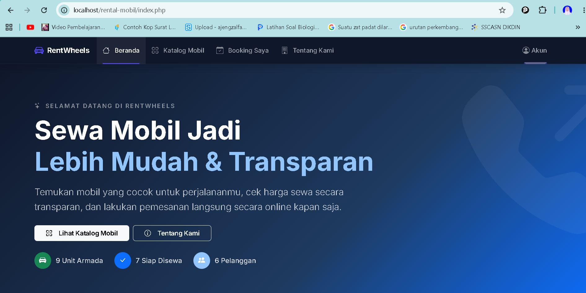
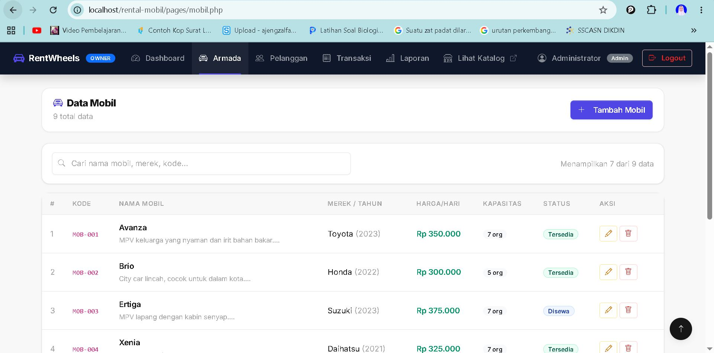
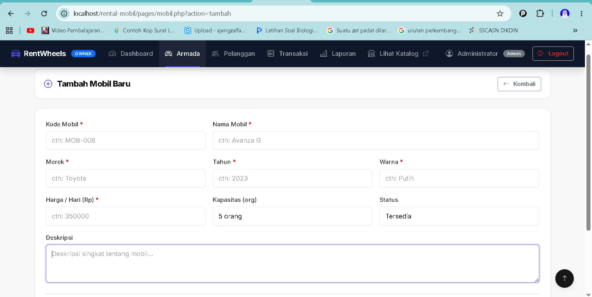
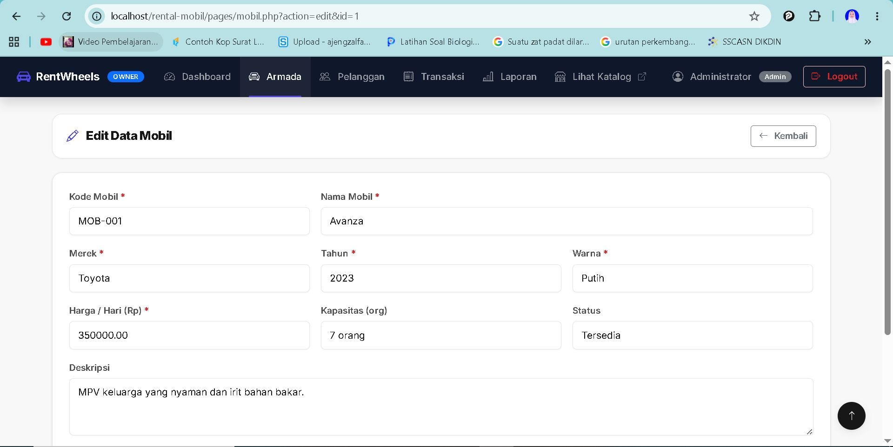
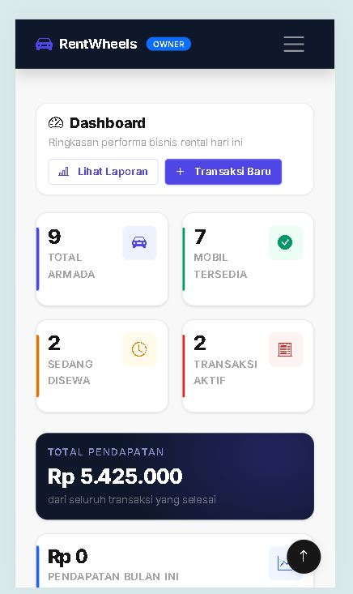

# RentWheels (Sistem Manajemen Rental Mobil)

## Deskripsi Proyek

Aplikasi web **Rental Mobil** berbasis PHP Native yang digunakan untuk mengelola data
mobil, pelanggan, dan transaksi penyewaan. Aplikasi ini mendukung fitur
**CRUD (Create, Read, Update, Delete)** serta sistem login aman menggunakan
`session_start()`, `password_hash()`, dan `password_verify()`.

Proyek ini dibuat untuk memenuhi **Ujian Akhir Semester Praktikum Pemrograman Web 1**
(SVPL214208) Teknologi Rekayasa Perangkat Lunak, Sekolah Vokasi, Universitas Gadjah Mada.

---

## Fitur Utama

### Autentikasi
- Login menggunakan **PHP Session** (`session_start()`)
- Password terenkripsi dengan **bcrypt** (`password_hash()` & `password_verify()`)
- Redirect otomatis jika belum login
- Halaman register untuk pelanggan baru

### Manajemen Data (CRUD)
- **Data Mobil** untuk tambah, lihat, edit, hapus armada kendaraan
- **Data Pelanggan** untuk tambah, lihat, edit, hapus data pelanggan
- **Data Transaksi** untuk catat, lihat, ubah status, hapus transaksi sewa

### Fitur Tambahan
- Search / pencarian data real-time
- Pagination sederhana
- Validasi form dengan **JavaScript** (minimal 2 field per form)
- Konfirmasi hapus dengan `confirm()`
- Manipulasi DOM pesan error inline

---

## Teknologi yang Digunakan

| Kategori | Teknologi |
|----------|-----------|
| Frontend | HTML5, CSS3, Bootstrap 5, Bootstrap Icons |
| Interaktivitas | JavaScript (Vanilla) |
| Backend | PHP Native |
| Database | MySQL |
| Tools | XAMPP / Laragon, phpMyAdmin, Git & GitHub |

## Struktur Folder

```text
rental-mobil/
├── assets/
│   ├── css/
│   │   └── style.css            → CSS kustom tambahan
│   ├── js/
│   │   ├── app.js               → Scroll, search, inisialisasi
│   │   └── script.js            → Validasi form, confirm hapus, DOM
│   └── img/                     → Gambar mobil & aset visual
├── includes/
│   ├── config.php               → Koneksi database (EXCLUDE dari git!)
│   ├── header.php               → Navbar & head HTML
│   ├── footer.php               → Footer HTML
│   └── auth_check.php           → Cek session login
├── pages/
│   ├── login.php                → Halaman login
│   ├── register.php             → Halaman register
│   ├── logout.php               → Proses logout
│   ├── dashboard.php            → Dashboard admin/petugas
│   ├── mobil.php                → CRUD data mobil
│   ├── pelanggan.php            → CRUD data pelanggan
│   ├── transaksi.php            → CRUD data transaksi
│   ├── booking.php              → Form booking pelanggan
│   └── laporan.php              → Laporan & statistik
├── index.php                    → Halaman beranda (landing page)
├── katalog.php                  → Katalog mobil publik
├── tentang.php                  → Halaman tentang kami
├── database.sql                 → Export database MySQL (struktur + data)
├── .gitignore                   → Exclude config.php & file sensitif
└── README.md                    → Dokumentasi proyek ini

## Cara Menjalankan Proyek

### 1. Clone Repository

```bash
git clone https://github.com/zalfaajengsuardafa-web/rental_mobil-.git  
```

### 2. Pindahkan ke Folder Server

- **XAMPP:** salin ke `C:/xampp/htdocs/rental-mobil/`
- **Laragon:** salin ke `C:/laragon/www/rental-mobil/`

### 3. Buat & Import Database

1. Nyalakan Apache dan MySQL di XAMPP/Laragon
2. Buka **phpMyAdmin** =`http://localhost/phpmyadmin`
3. Klik **Import** = pilih file `database.sql`
4. Klik **Go** = database `rental_mobil` dan semua tabel akan dibuat otomatis

### 4. Buat File Konfigurasi Database

```php
<?php
define('DB_HOST', 'localhost');
define('DB_USER', 'root');     
define('DB_PASS', '');         
define('DB_NAME', 'rental_mobil');
define('DB_CHARSET', 'utf8mb4');

$conn = new mysqli(DB_HOST, DB_USER, DB_PASS, DB_NAME);
if ($conn->connect_error) {
    die('Koneksi gagal: ' . $conn->connect_error);
}
$conn->set_charset(DB_CHARSET);

define('APP_NAME', 'RentWheels');
define('APP_TAGLINE', 'Sistem Manajemen Rental Mobil');
define('BASE_URL', 'http://localhost/rental-mobil/');
?>
```

### 5. Akses Aplikasi
http://localhost/rental-mobil/


### 6. Akun Demo

| Role | Username | Password |
|------|----------|----------|
| Admin | `admin` | `admin123` |
| Admin | `zalfa` | `admin123` |
| Petugas | `ajeng` | `ajeng123` |
| Petugas | `azka` | `azka123` |

---

## Screenshot Aplikasi

### Halaman Beranda


### Halaman Daftar Data Mobil


### Form Tambah Data


### Form Edit Data


### Tampilan Mobile (375px)


---

## Keamanan

| Fitur | Implementasi |
|-------|-------------|
| XSS Prevention | `htmlspecialchars()` pada seluruh output user-input (134 penggunaan) |
| Password | `password_hash()` — bcrypt, bukan MD5 |
| Verifikasi | `password_verify()` |
| Session | `session_start()` + auth_check di semua halaman protected |
| SQL Injection | Prepared statement (`prepare()` + `bind_param()`) — 102 penggunaan |
| Konfigurasi | `config.php` dipisah dan di-exclude dari Git via `.gitignore` |

---
## Responsivitas

Dirancang dengan Bootstrap 5 Grid sehingga tampil baik di:

| Ukuran Layar | Breakpoint Bootstrap |
|-------------|---------------------|
| Mobile | ≥ 375px (`col-12`) |
| Tablet | ≥ 768px (`col-md-*`) |
| Desktop | ≥ 1024px (`col-lg-*`) |
| Wide | ≤ 1440px |

---

## Spesifikasi Teknis (Sesuai UAS)

### Bootstrap
- [x] Sistem grid Bootstrap (container, row, col-*)
- [x] Navbar responsif dengan collapse di mobile
- [x] Komponen: Card, Button, Badge, Alert, Modal, Pagination
- [x] Layout tidak rusak di 375px s.d. 1440px

### JavaScript
- [x] Validasi form minimal 2 field sebelum submit
- [x] `confirm()` sebelum hapus data
- [x] Manipulasi DOM pesan error inline
- [x] `addEventListener` (scroll, input, change, submit)

### PHP & Database
- [x] `htmlspecialchars()` pada seluruh output
- [x] `password_hash()` / `password_verify()`
- [x] `session_start()` untuk autentikasi
- [x] Prepared statement untuk semua query
- [x] `config.php` dipisah dari file utama

---

## Author

| | |
|-|-|
| **Nama** | Zalfa Ajeng Suardafa |
| **NIM** | 25/568990/SV/27577 |
| **Prodi** | Teknologi Rekayasa Perangkat Lunak |
| **Universitas** | Universitas Gadjah Mada Sekolah Vokasi |
| **Mata Kuliah** | Praktikum Pemrograman Web 1 (SVPL214208) |
| **Dosen** | Achmad Choirudin Emcha, S.Kom., M.Eng. |

---

## Video Demo
> Link video demo: https://youtu.be/57mO1SF1uww?si=JcH3y-Zw2uuv-Zkb  
---
